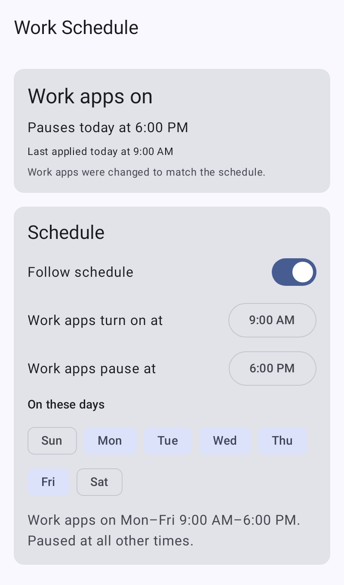
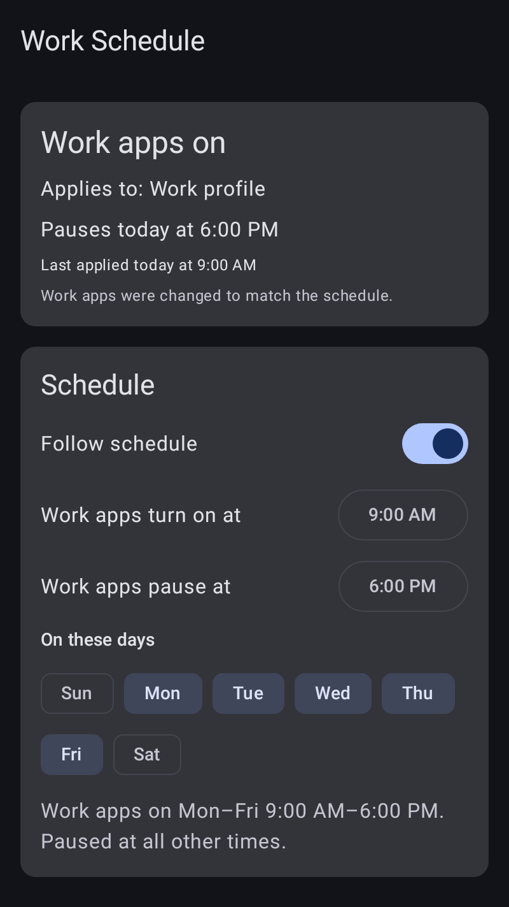
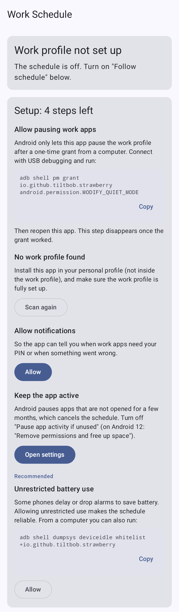

# Work Schedule

A tiny Android app that pauses and unpauses your **work profile** on a weekly schedule, for
example: work apps on Monday to Friday from 09:00 to 18:00, paused at all other times.

It does what the "Work apps" tile in Quick Settings does, just automatically. There is no
server, no account and no tracking; everything stays on the phone.

<p>
  
  
  
</p>

## Requirements

- Android 11 or newer.
- A work profile (the one your employer's device management app set up), with this app
  installed in your **personal** profile.
- A computer with `adb`, once, to grant one permission. Android offers no other way for a
  regular app to pause the work profile. If your employer has blocked USB debugging on the
  phone, the permission cannot be granted and the app cannot work.

## Install

1. Download `work-schedule-<version>.apk` from the
   [latest release](https://github.com/tiltbob/strawberry/releases/latest). Or let
   [Obtainium](https://github.com/ImranR98/Obtainium) install it and tell you about new
   versions: choose **Add App**, paste `https://github.com/tiltbob/strawberry` and add it. If
   you want to be strict about which asset it picks, set the APK filter to
   `work-schedule-.*\.apk`.
2. Install the APK on the phone, for example with
   `adb install --user current -r work-schedule-<version>.apk` (or copy it over and open it).
   Without `--user`, adb installs the app for every user on the phone, including the work
   profile, so use this same command for every update too. If a copy with the work badge has
   already appeared in the work profile, uninstall that copy from the work profile's app list;
   the personal copy and its permission stay as they are.
3. Grant the permission (see below), open the app and set your schedule.

Every release is signed with the same key, so a new release installs over the old one and keeps
the permission. Do not uninstall to update: uninstalling drops the permission and you have to
grant it again.

### Development builds

Every push also builds a debug APK: open the
[Actions tab](https://github.com/tiltbob/strawberry/actions), pick the latest successful run and
download the `work-schedule-debug-apk` artifact (unzip it; you need to be signed in to GitHub
to download it). GitHub deletes artifacts after 90 days; the repository owner can build a fresh
one under Actions > Android CI > Run workflow, or you can build the APK yourself (see
[Building locally](#building-locally)).

Debug builds are signed with the public debug key, not with the release key, so Android refuses
to install one kind over the other. Switching between a release and a debug build means
uninstalling first, which drops the permission: grant it again afterwards.

## adb commands

Turn on Developer options on the phone (Settings > About phone, tap Build number seven times),
then enable USB debugging (Settings > System > Developer options; the location varies by phone
maker), connect the phone, accept the debugging prompt on the phone and run:

```sh
adb shell pm grant io.github.tiltbob.strawberry android.permission.MODIFY_QUIET_MODE
```

`pm grant` applies to Android user 0, which is the normal case. If your personal profile is a
different user (the app shows the exact command including `--user N` when it is), add that:

```sh
adb shell pm grant --user 10 io.github.tiltbob.strawberry android.permission.MODIFY_QUIET_MODE
```

The command can print nothing and still not work (for example if you typed the package name
wrong), so check it. Either reopen the app (the setup step disappears once the permission is
granted) or run:

```sh
adb shell dumpsys package io.github.tiltbob.strawberry | grep MODIFY_QUIET_MODE
```

and look for `granted=true`.

Afterwards you can turn USB debugging (and Developer options) off again: the permission stays
granted, also when you install updates over the app. Some employers' device policies and some
banking apps object to USB debugging being on, so turn it off if you do not need it. You need it
again only to grant the permission after an uninstall, or when you update with `adb install`
instead of opening the new APK on the phone.

Optional but recommended: exempt the app from battery optimization so the schedule runs on
time even on phones that delay alarms. You can also do this from the app.

```sh
adb shell dumpsys deviceidle whitelist +io.github.tiltbob.strawberry
```

## How it behaves

- **One window per day.** You pick a start time, an end time and the days. Work apps are on
  inside the window and paused at all other times. If the end time is before the start time the
  window runs overnight and ends the next day (22:00 to 06:00); the same start and end time means
  24 hours. The days are the days a window *starts* on.
- **It only acts at the start and end of the window.** If you pause or unpause work apps by hand
  in between, the app leaves that alone until the next change in the schedule.
- **It re-applies the schedule after a reboot and whenever you change the schedule** (including
  turning "Follow schedule" on). A missed change, for example while the phone was off or after
  the clock or time zone changed, is applied as soon as the app notices.
- **Turning off "Follow schedule"** stops all alarms; the app then changes nothing.
- The app uses exact alarms and shows the next change on its screen. On Android 12 and 12L, if
  you later turn off "Alarms & reminders" for the app, Android deletes its pending alarm without
  telling it. Open the app once afterwards so it can switch to regular (up to an hour late)
  alarms.

### If your work profile has its own PIN

With one screen lock for both profiles, turning work apps on works silently, even while the
phone is locked (Android keeps the unlock for a while after you last unlocked the phone).

If your work profile has a **separate work PIN or pattern**, Android always asks for it before
work apps turn on; on Android 14 and newer an app can never do that silently. In that case the
app shows a notification "Tap to turn on work apps" at the start of the window. Tap it and
Android asks for your work PIN. The status in the app also shows this. Pausing never needs a
PIN.

## Caveats

- **Pixel "Work apps schedule":** Digital Wellbeing on Pixel phones has its own work schedule.
  Use one or the other; two schedules fight each other.
- **Company-owned phones:** on a company-owned phone that has a work profile (sometimes called
  COPE), your IT admin can limit how long the work profile may stay off (at least 3 days). If
  it stays off longer, your personal apps get suspended until you turn work apps back on. A
  normal weekend (Friday 18:00 to Monday 09:00, 63 hours) is fine, but long weekends or a failed
  unpause can go over. Watch for the app's notifications.
- **Your employer can see it:** the device management app is told when the work profile is
  paused or unpaused (not which app did it).
- **Pausing closes work apps**, including a running work call, when the window ends.
- **Battery savers:** some phone makers stop background apps aggressively. Allow unrestricted
  battery use (the app offers a button, or use the adb command above) if changes come late or
  not at all.
- **Unused apps:** Android 12 and newer pauses apps you have not opened for a few months, which
  cancels their alarms. The app asks you to turn this off for it. Opening the app also repairs its alarms.
- **Several work profiles:** some phones have features that look like a second work profile
  (for example Samsung Secure Folder). The app then asks which one to use. It never pauses a
  profile it cannot identify unless you pick it yourself.

## Building locally

You need JDK 21 and the Android SDK (platform 36). Point Gradle at the SDK by setting
`ANDROID_HOME`, or by creating a `local.properties` file containing
`sdk.dir=/path/to/android-sdk` (Android Studio does this for you).

```sh
./gradlew assembleDebug testDebugUnitTest lintDebug
```

The APK ends up in `app/build/outputs/apk/debug/`.

`./gradlew assembleRelease` builds the release APK. It is unsigned unless
`STRAWBERRY_KEYSTORE_FILE`, `STRAWBERRY_KEYSTORE_PASSWORD`, `STRAWBERRY_KEY_ALIAS` and
`STRAWBERRY_KEY_PASSWORD` are set in the environment. Pass
`-PstrawberryVersionName=… -PstrawberryVersionCode=…` to override the version; the release
workflow derives both from the tag.

`app/debug.keystore` is committed on purpose: it is a **publicly known debug key** (store and
key password `android`, alias `androiddebugkey`) that exists only so that every debug build,
local or CI, has the same signature and installs over the previous one. It offers no
protection; anyone can sign an APK with it. Only install debug builds from this repository's
Actions or your own machine. Releases are signed with the project's own key instead.

## Cutting a release (maintainers)

The release workflow (`.github/workflows/release.yml`) runs when a tag like `v1.2.3` is pushed:
it runs the unit tests, builds the release APK signed with the project key, checks the
signature, and creates a GitHub Release named after the tag with `work-schedule-1.2.3.apk` and
its SHA-256. The tag decides both the version name and the version code
(`major * 1000000 + minor * 1000 + patch`), so tags must be strictly increasing. A pre-release
suffix such as `v1.2.3-rc1` is accepted but shares its version code with the final `v1.2.3`.

One-time setup, from a laptop with `gh` logged in (no Java needed, about a minute):

```sh
gh repo clone tiltbob/strawberry && cd strawberry
scripts/setup-signing.sh
```

The script creates a 4096-bit RSA key and a 100-year certificate with `openssl`, writes them
to the repository's Actions secrets (`KEYSTORE_BASE64`, `KEYSTORE_PASSWORD`, `KEY_ALIAS`,
`KEY_PASSWORD`) and securely wipes the local copy, so GitHub holds the only one. It prints the
certificate fingerprint for your records. Android only installs updates signed with the same
key, and for this app an uninstall also drops the adb-granted permission, so never delete or
replace those secrets once a release is out. `--dry-run` shows what the script would do without
writing anything; the comments at the top of the script explain how to share one key across
several repositories.

Then:

```sh
git tag v0.1.0
git push origin v0.1.0
```

Every push also runs `.github/workflows/android.yml` (tests, lint, debug APK as a build
artifact).
